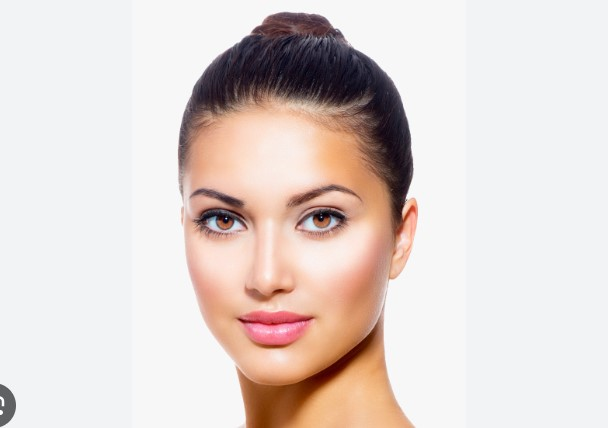
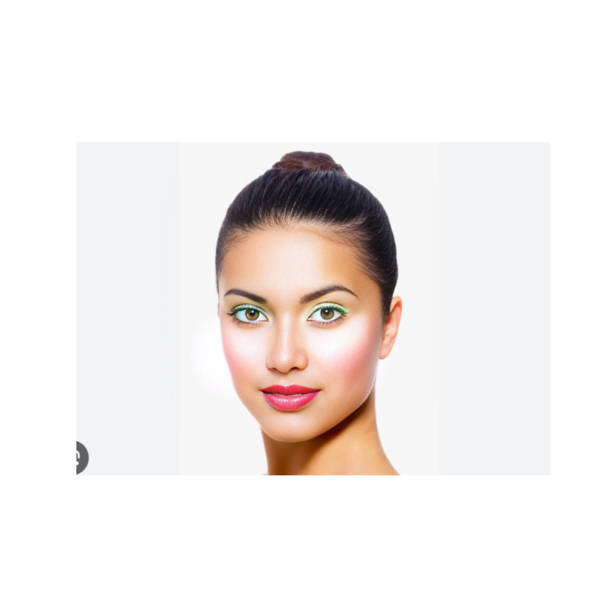
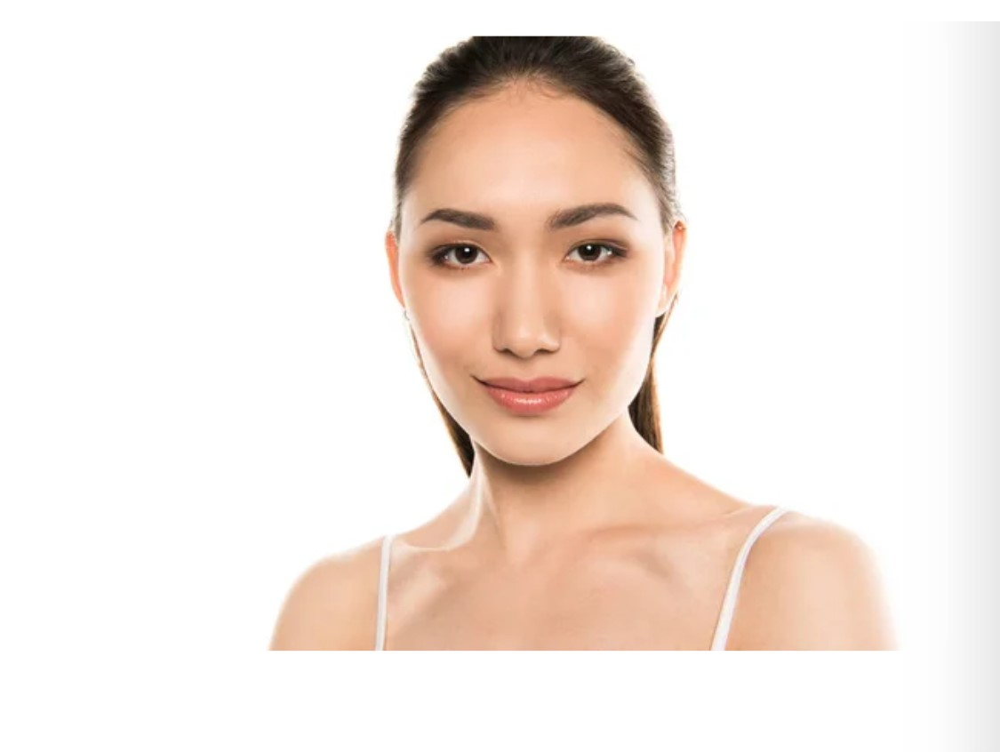
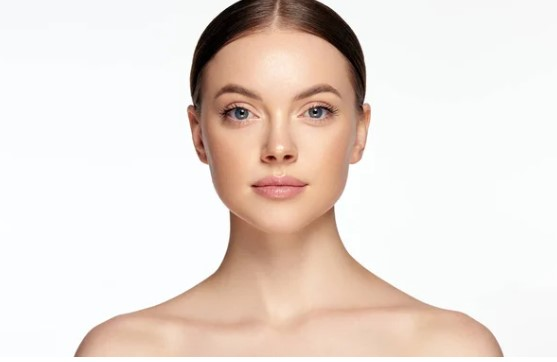

# Makeup Application and Face Restoration Pipeline

This repository includes scripts for applying makeup effects to images and then refining them using face restoration techniques. It consists of:

- **`makeup.py`**: Applies makeup effects to an image.
- **`codeformer.py`**: Enhances the makeup-applied image using the CodeFormer model.

## Prerequisites

Make sure you have the following software and libraries installed:

### Python Version

- Python 3.7+ is required.

### Install Dependencies

Install the necessary libraries using `pip`:

```bash pip install opencv-python torch numpy Pillow face_recognition basicsr facelib torchvision ```


### Clone CodeFormer Repository

Clone the CodeFormer repository to obtain the required code and models:

```bash
git clone https://github.com/sczhou/CodeFormer.git
cd CodeFormer
```

### Download Pre-trained Models

The `codeformer.py` script will automatically download the pre-trained CodeFormer model if it's not already present. Ensure you have an active internet connection.

## Usage

### 1. Apply Makeup

Run the `makeup.py` script to apply makeup effects to your input image:

```bash
python makeup.py --input_image <path_to_image> --output_image <path_to_output_image>
```

**Arguments**:
- `--input_image`: Path to the input image file.
- `--output_image`: Path to save the makeup-applied image.

**Example**:

```bash
python makeup.py --input_image input.jpg --output_image makeup.jpg
```

### 2. Refine with CodeFormer

After applying makeup, use the `codeformer.py` script to enhance the image:

```bash
python codeformer.py --enhance_option <1|2>
```

**Arguments**:
- `--enhance_option`: Level of enhancement; `1` for low, `2` for high.

**Example**:

```bash
python codeformer.py --enhance_option 2
```

- The refined image will be saved in the `results` directory.

## Workflow

1. **Apply Makeup**:
   - Use `makeup.py` to add makeup effects to your image.

   ```bash
   python makeup.py --input_image input.jpg --output_image makeup.jpg
   ```

2. **Refine Image**:
   - Use `codeformer.py` to enhance the makeup-applied image.

   ```bash
   python codeformer.py --enhance_option 2
   ```

   - The processed image will be saved in the `results` directory.
  
## Results

Below are the results showcasing the original images, different makeup effects applied, and the final output refined using the CodeFormer pipeline.

### Image 1
| Original | Makeup 1 | Makeup 2 | Makeup 3 | Makeup 4 | 
|----------|----------|----------|----------|----------|
|  |  | .jpg) | .jpg) | .jpg)  |

### Image 2
| Original | Makeup 1 | Makeup 2 | Makeup 3 | Makeup 4 | Restored |
|----------|----------|----------|----------|----------|----------|
|  |  |  |  |  |  |

### Image 3
| Original | Makeup 1 | Makeup 2 | Makeup 3 | Makeup 4 | Restored |
|----------|----------|----------|----------|----------|----------|
|  |  |  |  |  |  |


## License

This project is licensed under the MIT License. See the [LICENSE](LICENSE) file for details.

## Acknowledgements

- **CodeFormer**: [CodeFormer GitHub](https://github.com/sczhou/CodeFormer)
- Makeup effects are implemented using `face_recognition` and `Pillow`.

## Contact

For questions or issues, please open an issue on the [GitHub repository](https://github.com/yourusername/yourrepository).
```

